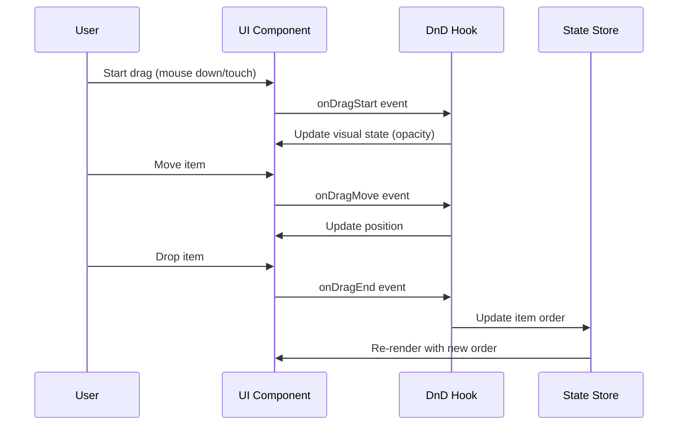
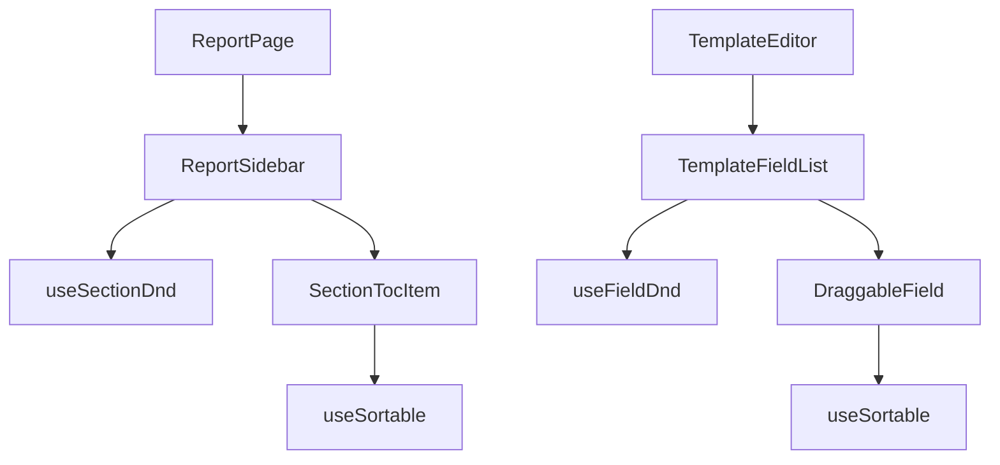

# Design Document

## Overview

This design document outlines the implementation of drag-and-drop functionality for the Linguosity report generation system. The feature will enhance the user experience by allowing Speech-Language Pathologists to intuitively reorder report sections in the sidebar navigation and template fields in the template editor. The implementation will use the @dnd-kit library, which provides accessible, performant drag-and-drop capabilities.

## Architecture

The drag-and-drop functionality will be implemented using a combination of custom React hooks and components that leverage the @dnd-kit library. The architecture follows these principles:

1. **Separation of Concerns**: Drag-and-drop logic is encapsulated in custom hooks that can be reused across different components.
2. **Accessibility**: The implementation supports keyboard navigation and screen readers.
3. **Performance**: The library uses the React concurrent mode and optimizes re-renders.
4. **Type Safety**: TypeScript is used throughout to ensure type safety and improve developer experience.

## Components and Interfaces

### Core Hooks

1. **useSectionDnd**
   - Purpose: Manages drag-and-drop functionality for report sections in the sidebar
   - Inputs: Array of section IDs, callback for order changes
   - Outputs: Provider component for wrapping sortable items

2. **useFieldDnd**
   - Purpose: Manages drag-and-drop functionality for template fields
   - Inputs: Array of field IDs, callback for order changes
   - Outputs: Provider component for wrapping sortable items

### UI Components

1. **ReportSidebar**
   - Purpose: Renders the sidebar with draggable section items
   - Props: sections array, active section ID, callbacks for selection and reordering
   - State: None (stateless component)

2. **SectionTocItem**
   - Purpose: Renders a single draggable section item in the sidebar
   - Props: section object, active state, selection callback
   - State: None (stateless component)

3. **TemplateFieldList**
   - Purpose: Renders a list of draggable template fields
   - Props: fields array, callback for updating fields
   - State: None (stateless component)

### Component Hierarchy

```
ReportPage
└── ReportSidebar (uses useSectionDnd)
    └── SectionTocItem[] (uses useSortable)
        
TemplateEditor
└── TemplateFieldList (uses useFieldDnd)
    └── DraggableField[] (uses useSortable)
```

## Data Models

### Section

```typescript
interface Section {
  id: string;
  title: string;
  required?: boolean;
  complete?: boolean;
  // Other section properties
}
```

### Field

```typescript
interface Field {
  id: string;
  label: string;
  type: string;
  // Other field properties
}
```

## Error Handling

1. **Invalid Drag Operations**
   - If a user attempts to drag an item to an invalid location, the operation will be prevented.
   - Visual feedback will indicate when a drop location is invalid.

2. **Concurrent Edits**
   - If multiple users edit the same report or template simultaneously, the system will use optimistic updates locally and handle conflicts on the server.
   - In case of conflicts, the latest change will be preserved and users will be notified.

3. **Network Issues**
   - Drag operations will work locally even with poor network connectivity.
   - Changes will be persisted when connectivity is restored.

## Testing Strategy

1. **Unit Tests**
   - Test custom hooks in isolation with mock data.
   - Test components with various props and states.

2. **Integration Tests**
   - Test the interaction between components.
   - Verify that drag operations update the state correctly.

3. **Accessibility Tests**
   - Test keyboard navigation.
   - Test screen reader compatibility.

4. **Browser Compatibility Tests**
   - Test on Chrome, Firefox, Safari, and Edge.
   - Test on touch devices.

## Implementation Plan

The implementation will follow these steps:

1. Install @dnd-kit dependencies
2. Create custom hooks for drag-and-drop functionality
3. Implement the sidebar components with drag-and-drop
4. Implement the template field components with drag-and-drop
5. Add visual feedback and animations
6. Implement keyboard navigation
7. Test and refine the implementation

## Technical Considerations

1. **Performance**
   - Use memoization to prevent unnecessary re-renders.
   - Optimize drag operations for large lists.

2. **Accessibility**
   - Ensure keyboard navigation works correctly.
   - Add appropriate ARIA attributes.

3. **Mobile Support**
   - Ensure touch interactions work smoothly.
   - Adjust the UI for smaller screens.

## Diagrams

### Drag-and-Drop Flow



### Component Interaction

