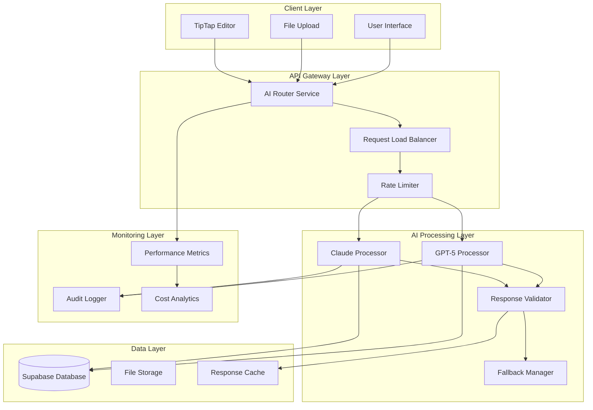
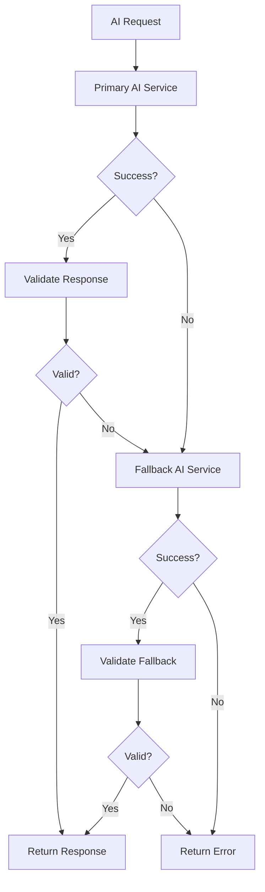

# Design Document

## Overview

This design outlines the migration of Linguosity's AI processing system from Claude Opus 4.1 to GPT-5, implementing a hybrid approach that leverages the strengths of both models while ensuring seamless functionality and significant cost savings. The migration will be implemented as a gradual rollout with comprehensive fallback mechanisms and performance monitoring.

## Architecture

### High-Level Architecture



### Migration Strategy

The migration will follow a **Blue-Green Deployment** pattern with **Feature Flags** to enable gradual rollout:

1. **Phase 1**: Parallel Processing (Both APIs active)
2. **Phase 2**: Gradual Traffic Shift (10% → 50% → 90% → 100%)
3. **Phase 3**: Claude Deprecation (Fallback only)
4. **Phase 4**: Full GPT-5 Operation

## Components and Interfaces

### 1. AI Router Service

**Purpose**: Central routing and orchestration of AI requests

```typescript
interface AIRouterService {
  // Route requests to appropriate AI service
  routeRequest(request: AIRequest): Promise<AIResponse>
  
  // Determine which AI service to use
  selectAIService(request: AIRequest): AIServiceType
  
  // Handle fallback scenarios
  handleFallback(request: AIRequest, error: Error): Promise<AIResponse>
}

interface AIRequest {
  type: 'section_generation' | 'multimodal_processing' | 'intake_processing'
  reportId: string
  sectionIds: string[]
  content: ContentInput[]
  options: ProcessingOptions
  userPreferences?: UserPreferences
}

interface AIResponse {
  success: boolean
  data: any
  metadata: ResponseMetadata
  processingTime: number
  aiService: AIServiceType
  confidence: number
}

type AIServiceType = 'gpt5' | 'claude' | 'hybrid'
```

### 2. GPT-5 Integration Service

**Purpose**: Handle GPT-5 specific API calls and custom tools

```typescript
interface GPT5Service {
  // Process requests using GPT-5
  processRequest(request: AIRequest): Promise<GPT5Response>
  
  // Use custom tools for TipTap integration
  processWithCustomTools(request: AIRequest): Promise<GPT5Response>
  
  // Handle structured data generation
  generateStructuredData(request: StructuredDataRequest): Promise<StructuredDataResponse>
}

interface GPT5CustomTool {
  name: string
  description: string
  parameters: Record<string, any>
  handler: (input: any) => Promise<any>
}

// Custom tools for TipTap integration
const tiptapTools: GPT5CustomTool[] = [
  {
    name: "update_tiptap_content",
    description: "Updates TipTap editor content with raw HTML/markdown",
    parameters: {
      section_id: "string",
      content: "string", // Raw HTML/markdown without JSON escaping
      merge_strategy: "replace | append | merge"
    },
    handler: updateTipTapContent
  },
  {
    name: "apply_content_diff",
    description: "Applies diff-style changes to existing content",
    parameters: {
      section_id: "string",
      diff_operations: "array" // Array of diff operations
    },
    handler: applyContentDiff
  }
]
```

### 3. Response Validator and Data Integrity

**Purpose**: Ensure response quality and data integrity across both AI services

```typescript
interface ResponseValidator {
  // Validate AI response structure
  validateResponse(response: AIResponse): ValidationResult
  
  // Check data integrity
  validateDataIntegrity(data: any): IntegrityResult
  
  // Compare responses from different AI services
  compareResponses(gpt5Response: AIResponse, claudeResponse: AIResponse): ComparisonResult
}

interface ValidationResult {
  isValid: boolean
  errors: string[]
  warnings: string[]
  confidence: number
  suggestedFallback?: boolean
}

interface IntegrityResult {
  hasCircularReferences: boolean
  hasCorruptedData: boolean
  cleanedData?: any
  issuesFound: string[]
}
```

### 4. Cost Analytics and Monitoring

**Purpose**: Track costs, performance, and quality metrics

```typescript
interface CostAnalytics {
  // Track API usage and costs
  trackAPIUsage(service: AIServiceType, tokens: number, cost: number): void
  
  // Generate cost reports
  generateCostReport(timeframe: TimeFrame): CostReport
  
  // Compare costs between services
  compareCosts(service1: AIServiceType, service2: AIServiceType): CostComparison
}

interface PerformanceMonitor {
  // Track response times
  trackResponseTime(service: AIServiceType, duration: number): void
  
  // Track success rates
  trackSuccessRate(service: AIServiceType, success: boolean): void
  
  // Track quality metrics
  trackQualityMetrics(service: AIServiceType, metrics: QualityMetrics): void
}
```

## Data Models

### Migration Configuration

```typescript
interface MigrationConfig {
  // Feature flags for gradual rollout
  featureFlags: {
    enableGPT5: boolean
    gpt5TrafficPercentage: number
    enableParallelProcessing: boolean
    enableFallback: boolean
  }
  
  // Service preferences by endpoint
  endpointConfig: {
    [endpoint: string]: {
      primaryService: AIServiceType
      fallbackService: AIServiceType
      timeout: number
      retryAttempts: number
    }
  }
  
  // Cost thresholds and limits
  costLimits: {
    dailyLimit: number
    monthlyLimit: number
    perRequestLimit: number
  }
}
```

### API Response Schemas

```typescript
// Enhanced response schema for GPT-5
interface GPT5Response extends AIResponse {
  customToolResults?: CustomToolResult[]
  contextWindow: {
    tokensUsed: number
    tokensRemaining: number
    contextSize: number
  }
  plainTextContent?: string // For TipTap integration
}

// Maintain compatibility with Claude responses
interface ClaudeResponse extends AIResponse {
  toolUse?: ToolUseBlock[]
  stopReason: string
  usage: {
    inputTokens: number
    outputTokens: number
  }
}
```

## Error Handling

### Fallback Strategy



### Error Categories and Handling

1. **API Errors**
   - Rate limiting: Exponential backoff + fallback
   - Overload errors: Immediate fallback
   - Authentication errors: Service-specific retry

2. **Validation Errors**
   - Schema validation failures: Retry with stricter prompts
   - Data integrity issues: Apply cleanup + retry
   - Confidence below threshold: Request re-processing

3. **Performance Errors**
   - Timeout: Fallback to faster service
   - Memory issues: Reduce context window
   - Token limit exceeded: Chunk processing

## Testing Strategy

### A/B Testing Framework

```typescript
interface ABTestConfig {
  testName: string
  trafficSplit: {
    control: number // Claude percentage
    treatment: number // GPT-5 percentage
  }
  metrics: string[]
  duration: number
  successCriteria: SuccessCriteria
}

interface SuccessCriteria {
  minSuccessRate: number
  maxResponseTime: number
  minQualityScore: number
  maxCostIncrease: number
}
```

### Quality Assurance

1. **Automated Testing**
   - Unit tests for each AI service integration
   - Integration tests for fallback scenarios
   - Performance tests for response times
   - Load tests for concurrent requests

2. **Manual Testing**
   - Side-by-side response comparison
   - User acceptance testing with SLPs
   - Edge case validation
   - TipTap integration testing

3. **Monitoring and Alerting**
   - Real-time error rate monitoring
   - Cost threshold alerts
   - Performance degradation alerts
   - Data integrity violation alerts

## Implementation Phases

### Phase 1: Foundation (Week 1-2)
- Implement AI Router Service
- Create GPT-5 integration service
- Set up response validation
- Implement basic monitoring

### Phase 2: Parallel Processing (Week 3-4)
- Enable parallel processing for comparison
- Implement A/B testing framework
- Set up cost analytics
- Create migration dashboard

### Phase 3: Gradual Migration (Week 5-8)
- Start with 10% traffic to GPT-5
- Monitor quality and performance metrics
- Gradually increase to 50%, then 90%
- Optimize based on feedback

### Phase 4: Full Migration (Week 9-10)
- Complete migration to GPT-5
- Maintain Claude as fallback only
- Optimize performance and costs
- Document lessons learned

## Security Considerations

1. **API Key Management**
   - Separate environment variables for each service
   - Rotation strategy for API keys
   - Secure storage in production

2. **Data Privacy**
   - Ensure both services comply with data protection
   - Audit data handling practices
   - Implement data retention policies

3. **Access Control**
   - Service-specific rate limiting
   - User-based access controls
   - Audit logging for all AI requests

## Performance Optimization

### Context Window Management

```typescript
interface ContextOptimizer {
  // Optimize context for GPT-5's larger window
  optimizeForGPT5(context: ReportContext): OptimizedContext
  
  // Maintain compatibility with Claude's limits
  optimizeForClaude(context: ReportContext): OptimizedContext
  
  // Dynamic context sizing based on available tokens
  dynamicContextSizing(context: ReportContext, availableTokens: number): OptimizedContext
}
```

### Caching Strategy

1. **Response Caching**
   - Cache successful responses by content hash
   - Implement cache invalidation strategies
   - Use Redis for distributed caching

2. **Context Caching**
   - Cache processed report contexts
   - Cache file processing results
   - Implement smart cache warming

## Migration Rollback Plan

### Rollback Triggers
- Success rate drops below 95%
- Response time increases by >50%
- Cost exceeds budget by >25%
- Critical data integrity issues

### Rollback Process
1. Immediate traffic redirect to Claude
2. Disable GPT-5 processing
3. Investigate and fix issues
4. Gradual re-enablement with monitoring

This design ensures a smooth, monitored migration that maintains system reliability while achieving the cost and performance benefits of GPT-5.